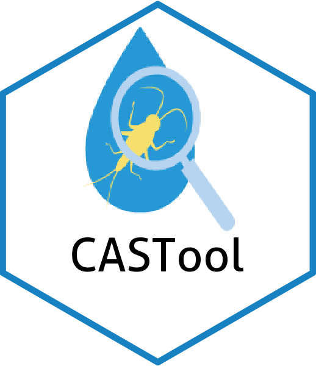
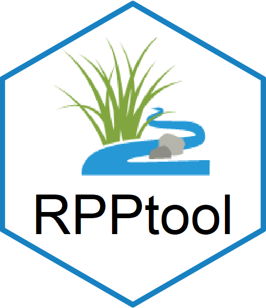

README-CASTfxn
================

<!-- README.md is generated from README.Rmd. Please edit that file -->

    #> Last Update: 2025-09-04 12:46:51.498096




## CASTfxn

Suite of functions for the Causal Assessment Screening Tool (CAST).
Includes Shiny app.

## Badges

[](https://GitHub.com/leppott/CASTfxn/graphs/commit-activity)
[](https://www.tidyverse.org/lifecycle/#stable)
[](https://github.com/leppott/CASTfxn/blob/master/LICENSE)

[](https://www.codefactor.io/repository/github/leppott/CASTfxn)
[](https://codecov.io/gh/leppott/CASTfxn)
[](https://github.com/leppott/CASTfxn/actions)

[](https://GitHub.com/leppott/CASTfxn/issues/)

[](https://GitHub.com/leppott/CASTfxn/releases/)
[](https://GitHub.com/leppott/CASTfxn/releases/)

## Installation

Requires the use of `remotes` (or another package) to install from
GitHub.

Vignettes are also not installed by default. The additional parameters
in install_github are used to ensure the install happens if there is an
existing install and to install the vignettes.

``` r
if(!require(remotes)){install.packages("remotes")}  #install if needed
install_github("leppott/CASTfxn", force=TRUE, build_vignettes = TRUE)
```

If using R v3.6 then need an extra line to allow devtools to work
properly. <https://github.com/r-lib/devtools/issues/1939>

``` r
Sys.setenv("TAR" = "internal")
```

If having issues with install (e.g., ‘cannot open URL’) it could be a
latency issue with GitHub. Use the code below before retrying the above
install commands.

``` r
options(timeout=400)
```

If installing from a private repo will need a PAT and a modifed install
command.

``` r
# save the PAT to your system environment
Sys.setenv(GITHUB_PAT = "your_personal_access_token_here")

# install from GitHub with the PAT
remotes::install_github("username/repo", auth_token = Sys.getenv("GITHUB_PAT"))
```

## Purpose

Functions to aid the data analysis and drive the functionality of the
Causal Assessment Screening Tool.

## Status

In development.

## Usage

By those using the CAST and familiar with causal assessment.

The code is intended to be run from the Shiny application but can also
be run in the R console.

## Shiny Apps

As of 2025-09-04 the Shiny applications were moved to their own
repository; <https://github.com/leppott/CAST_Shiny>

## Documentation

Vignette and install guide are planned for the future.

## Help

Functions in the package have a help file with extra documentation.
There is also a vignette with descriptions and examples of all functions
in the `CASTfxn` library.

``` r
# To get help on a function
# library(CASTfxn) # the library must be loaded before accessing help
?CASTfxn
```

To see all available functions in the package use the command below.

``` r
# To get index of help on all functions
# library(CASTfxn) # the library must be loaded before accessing help
help(package="CASTfxn")
```
